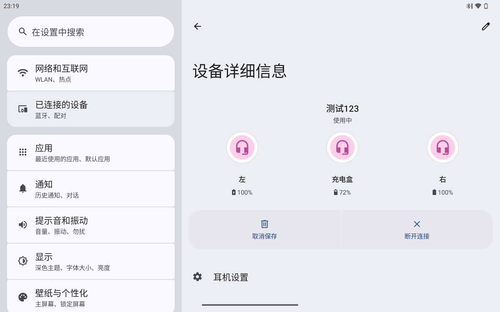
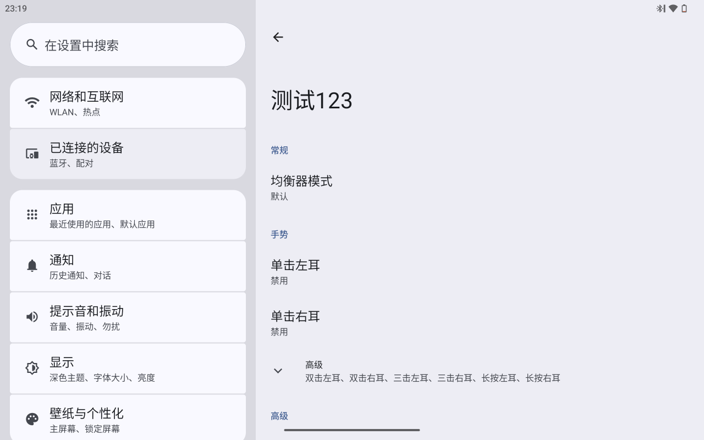

# android_packages_apps_XiaomiTWS

Integration of Xiaomi TWS into AOSP.

## Features

 - Reports the Xiaomi TWS earbuds' volume to the Android system.
 - Configures the equalizer settings.
 - Switches between noise cancellation modes.
 - Customizes single, double, triple-click, and long-press gestures for both ears.
 - Finds the earbuds.

## Supported Models

Currently, only TWS earbuds using the Xiaomi MMA protocol are supported.

## Integration Steps

1. Clone `android_packages_apps_XiaomiTWS` into the AOSP: `[AOSP code path]/packages/apps/XiaomiTWS/`.
2. Add `XiaomiTWS` to your device tree:
   ```makefile
   PRODUCT_PACKAGES += \
       XiaomiTWS
   ```

## Screenshots




## Credits

* [packages_apps_BtHelper](https://github.com/TheParasiteProject/packages_apps_BtHelper)
